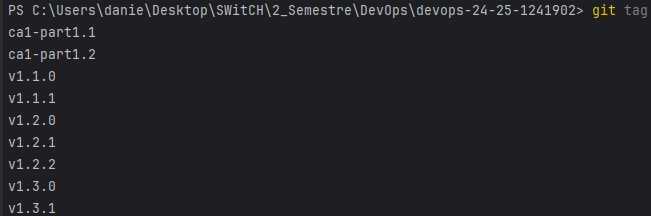
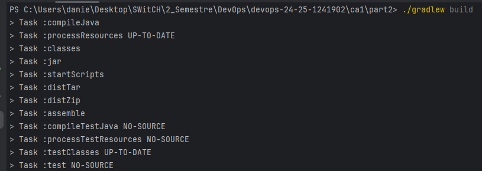

# Class Assignment 1: Technical Report

**Author:** Daniela Bento Martins (1241902)<br>
**Programme:** SWitCH DEV<br>
**Course:** DevOps</br>

### Table of Contents

- [Introduction](#introduction)
- [Part 1](#part-1)
  - [Part 1.1](#part-1-1)
  - [Part 1.2](#part-1-2)
  - [Part 1.3](#part-1-3)
- [Part 2](#part-2)
- [Part 3](#part-3)
  - [Part 3.1](#part-3-1)
  - [Part 3.2](#part-3-2)
- [Conclusion](#conclusion)

### Introduction

This DevOps assignment is divided into three main parts. The first part explores the Version Control with Git and includes an 
alternative to Git. The second part focuses on Build Tools with Gradle. The third part, covers a conversion of
the basic tutorial of the application (from part 1) to Gradle.

**Part 1** was also divided into three parts. The first, is intended to work without branches, the second relies on the use
of branches and the third, and final, explores an alternative solution to Git.

**Part 2** follows the topic of using build tools with Gradle, focusing on its practical applications.

**Part 3** aims to convert the basic version of the Tutorial application to Gradle. Its second part demonstrates an alternative
to Gradle, in this case Ant.
---

##  Part 1

### The Setup
Due to the nature of this project some configurations and changes had to be made so that the application could run smoothly.
I will be explaining these changes in the following steps.

- **Cloning the tutorial**

We were given access to a repository containing the Tutorial React.js and Spring Data REST application. This allowed us
to clone it and create a local copy using the following command:

```bash
git clone https://github.com/spring-guides/tut-react-and-spring-data-rest
```

- **Creating my repository**

I then created my own repository *devops-24-25-1241902* in GitHub to use throughout this project for all the assignments.
Once my repository was created, I cloned it into the right folder on my computer using the command:<br>
```bash
git clone <repository-URL> "C:\Users\danie\Desktop\SWitCH\2_Semestre\DevOps"
```

- **Copying the 'basic' folder**

In order to be able to run the application, I had to copy the basic folder inside the first repository to my own.
I created the folder *CA1* and inside, the folder *part1*. 

```bash
cp -r "/c/Users/danie/Desktop/SWitCH/2_Semestre/DevOps/tut-react-and-spring-data-rest/basic" "/c/Users/danie/Desktop/SWitCH/2_Semestre/DevOps/devops-24-25-1241902/CA1/part1"
 ```

- **Creating the .gitignore file**

Next, a .gitignore file was needed to showcase the list of files and directories to ignore when making a commit. For this,
I used [this website](https://www.toptal.com/developers/gitignore/) to generate this file and then added it to my
repository.

- **Executing the application**

With everything set, I was now able to run the application through my repository whenever I needed it. To do this, I had 
to move to the *basic* folder and run the command ``/mvnw spring-boot:run`` 
After this, I entered [this url](http://localhost:8080/) to check the application.

- **Structuring and organising the project**

Throughout this project I will be using the **Issues** feature in GitHub as a way to keep track of my tasks and ideas. These
issues can also be linked to my commits if I refer to them in my commit message.
As seen by the following example, I created an issue regarding one of the main tasks for this project named *"Add 'Job
Years' - validation and testing #1"* and the message contained a direct reference to the number of that issue, thus linking them.
~~~bash
git commit -m "Added validations and tests to Employee (related to issue #1)"
~~~

**Tags** will also play a very important part in the making of this project. They are used to mark specific points in
the repository's history. These tags can, and will, be pushed to the remote repository to ensure everyone can understand
the structure of this project. The following commands allow us to send add a tag to our project and then push it to the
remote repository:

~~~bash
git tag v1.0.0
git push origin v1.0.0
~~~

- **Starting**
My first commit to the GitHub repository (*'Initial Commit'*) was meant to officially establish the version history of my assignments 
in a remote location and thus ensure an organised start. For this I used the command ``git push -u origin main``.

The second (and most meaningful commit) sent to the repository happened once all of these changes and configurations were
all set. This commit (*'Added Basic folder and did small tweaks'*) followed the structure where I staged,
committed, and pushed my changes to the remote repository:

~~~bash
git add .
git commit -m "Added Basic folder and did small tweaks"
git push
~~~

### Part 1-1

### Goals & Requirements
 - Use of *tags* to keep track of the versions of the application;
 - Develop a new feature to add a new field to the application (*Job Years*);
 - Add unit tests for testing the creation of Employees and the validation of their attributes;
 - Practice debugging both the server and the client;
 - Use meaningful commits and tags.

### Development 
As mentioned before, I began by copying the basic folder from the given repository and commit it with the right tag associated to it. For this project, I am meant to follow the major.minor.revision
pattern so this was tagged as **v1.1.0**. I was able to do this with the aforementioned commands.

Regarding the development of the new feature, we were tasked with adding a new field *Job Years* to the Employee entity. As the provided example mentions the fictional world of Lord 
of the Rings, I chose to maintain this theme by using similar examples in my tests.

I will go through each class, detailing the changes and additions made, including new methods, attributes, and tests, to fulfil the project requirements.

- **Employee.java:** 

As requested, I added the jobYears field along with its getter and setter methods. To ensure data integrity, I also included validations in the setter methods. This was done to prevent invalid values
from being assigned and thus avoid potential errors. Both methods for jobYears can be found below and the setter method illustrates the updates
made to the other setter methods:

~~~java
	public int getJobYears(){
		return jobYears;
	}

	public void setJobYears(int jobYears) {
		if(areJobYearsInvalid(jobYears))
			throw new IllegalArgumentException("Insert a valid number of job years.");
		this.jobYears = jobYears;
	}
~~~

It was also necessary to validate all attributes: First Name, Last Name, Description, and Job Years. The first three, being of type String, were validated to ensure they were
neither null nor empty. For Job Years, an int type, I decided to restrict the value to non-negative numbers, with an upper limit of 100.

~~~java
	private boolean isFirstNameInvalid (String firstName) {
        return firstName == null || firstName.isBlank();
    }

	private boolean isLastNameInvalid (String lastName) {
		return lastName == null || lastName.isBlank();
	}

	private boolean isDescriptionInvalid (String description) {
		return description == null || description.isBlank();
	}
    
    private boolean isJobTitleInvalid (String jobTitle) {
        return jobTitle == null || jobTitle.isBlank();
    }

	private boolean areJobYearsInvalid(int jobYears) {
		
		return jobYears < 0 || jobYears > 100;
	}
~~~ 
Finally, I added validation to the Employee constructor by calling the existing validation methods for each attribute. This makes sure that any invalid data is caught when creating 
an Employee.

~~~java 
	public Employee(String firstName, String lastName, String description, int jobYears) {

		if(isFirstNameInvalid(firstName)){
			throw new IllegalArgumentException("First name cannot be empty!");
		}

		if(isLastNameInvalid(lastName)){
			throw new IllegalArgumentException("Last name cannot be empty!");
		}

		if(isDescriptionInvalid(description)){
			throw new IllegalArgumentException("Description cannot be empty!");
        }
        
        if(isJobTitleInvalid(jobTitle)){
            throw new IllegalArgumentException("Job title cannot be empty!");
        }

		if (areJobYearsInvalid(jobYears)){
			throw new IllegalArgumentException("Insert a valid number of job years.");
		}

		this.firstName = firstName;
		this.lastName = lastName;
		this.description = description;
        this.jobTitle = jobTitle;
        this.jobYears = jobYears;

	}
~~~

- **EmployeeTest.java**: 

This class was added to the newly created test directory, as there were no existing tests for the Employee class. 
The tests focus on verifying the functionality of the Employee constructor and ensuring that attribute validation works correctly.

~~~java
@Test
    void shouldCreateEmployee() {
        //Arrange

        // Act
        Employee employee = new Employee("Frodo", "Baggins", "Ring Bearer","Adventurer", 3);

        // Assert
        assertNotNull(employee);
        assertEquals("Frodo", employee.getFirstName());
        assertEquals("Baggins",employee.getLastName());
        assertEquals("Ring Bearer", employee.getDescription());
        assertEquals("Adventurer",employee.getJobTitle());
        assertEquals(3,employee.getJobYears());
    }

    public static Stream<Arguments> provideInvalidArguments() {
        return Stream.of(
                arguments(null,"Baggins","Ring Bearer","Adventurer",3,"First name cannot be empty!"),
                arguments("","Baggins","Ring Bearer","Adventurer", 3,"First name cannot be empty!"),
                arguments(" ","Baggins","Ring Bearer","Adventurer", 3,"First name cannot be empty!"),
                arguments("Frodo",null,"Ring Bearer","Adventurer", 3,"Last name cannot be empty!"),
                arguments("Frodo","","Ring Bearer","Adventurer", 3,"Last name cannot be empty!"),
                arguments("Frodo"," ","Ring Bearer","Adventurer",3,"Last name cannot be empty!"),
                arguments("Frodo","Baggins",null,"Adventurer",3,"Description cannot be empty!"),
                arguments("Frodo","Baggins","","Adventurer",3,"Description cannot be empty!"),
                arguments("Frodo","Baggins"," ","Adventurer",3,"Description cannot be empty!"),
                arguments("Frodo", "Baggins", "Ring Bearer",null,3, "Job title cannot be empty!"),
                arguments("Frodo", "Baggins", "Ring Bearer","",3, "Job title cannot be empty!"),
                arguments("Frodo", "Baggins", "Ring Bearer"," ",3, "Job title cannot be empty!"),
                arguments("Frodo","Baggins","Ring Bearer","Adventurer",-1,"Insert a valid number of job years."),
                arguments("Frodo","Baggins","Ring Bearer","Adventurer",101,"Insert a valid number of job years.")
        ); 
    }
    @ParameterizedTest
    @MethodSource("provideInvalidArguments")
    void testInvalidArguments(String firstName,String lastName, String description, String jobTitle, int jobYears, String expectedMessage) throws IllegalArgumentException {

        // Act + Assert
        IllegalArgumentException exception = assertThrows(IllegalArgumentException.class, () -> {
            new Employee(firstName,lastName,description,jobTitle,jobYears);
        });
        assertEquals(expectedMessage, exception.getMessage());
    }
~~~ 

The following examples demonstrate tests for the setter methods of the Employee class attributes.For each attribute, I’ve included two tests:
one that uses valid values to ensure the setter updates the attribute correctly, and another that uses invalid values to verify that the appropriate exception is thrown.
For the String type attributes, tests are focused on handling null and empty values, while for the int type attribute, tests ensure that the job years fall within an acceptable range (e.g., between 0 and 100).

Below is an example of a test for setting a valid value for job years, followed by a test that verifies invalid job years trigger the appropriate exception.

~~~java
    @Test
    void testSetJobYears_ValidValue() {
        //arrange
        Employee employee = new Employee();
        //act
        employee.setJobYears(5);
        //assert
        assertEquals(5, employee.getJobYears());
    }
    @Test
    void testSetJobYears_InvalidValue() {
        Employee employee = new Employee();

        assertAll(
                () -> assertThrows(IllegalArgumentException.class, () -> employee.setJobYears(-1)),
                () -> assertThrows(IllegalArgumentException.class, () -> employee.setJobYears(101))
        );
    }
~~~ 

- **DatabaseLoader.java:**

The class was modified to incorporate the jobYears field when saving sample employee data to the database. This update ensures that the employee records now include the 
number of years each employee has worked, enabling the application to showcase this feature immediately upon startup.

~~~java
	@Override
	public void run(String... strings) throws Exception { // <4>
		this.repository.save(new Employee("Frodo", "Baggins", "ring bearer","Adventurer",3));
	}
~~~

- **app.js:**

The React components were updated to include the new jobYears field, allowing users to view the number of years an employee has worked. The EmployeeList 
and Employee components now display this information in a dedicated 'Job Years' column within the employee table, ensuring that the feature is visible right from the start.

~~~javascript
class EmployeeList extends React.Component{
	render() {
		const employees = this.props.employees.map(employee =>
			<Employee key={employee._links.self.href} employee={employee}/>
		);
		return (
			<table>
				<tbody>
				<tr>
					<th>First Name</th>
					<th>Last Name</th>
					<th>Description</th>
					<th>Job Title</th>
                    <th>Job Years</th>
				</tr>
				{employees}
				</tbody>
			</table>
		)
	}
}
// end::employee-list[]

// tag::employee[]
class Employee extends React.Component{
	render() {
		return (
			<tr>
				<td>{this.props.employee.firstName}</td>
				<td>{this.props.employee.lastName}</td>
				<td>{this.props.employee.description}</td>
				<td>{this.props.employee.jobTitle}</td>
                <td>{this.props.employee.jobYears}</td>

			</tr>
		)
	}
}
~~~

**Debugging**

After making sure the jobYears field was integrated, I ran the app using ``./mvnw spring-boot:run `` to test it live at `` http://localhost:8080/``  This helped me 
check that everything was working as expected in the app and that the feature fit in smoothly with the rest of the functionality. I also did a quick code review to
ensure the data was being handled correctly on the server side and that jobYears was displaying properly on the client side.

**Finishing up**

Once everything was running smoothly, I needed to commit these changes to the remote repository. As previously mentioned, I created an Issue with the title "Add 'Job Years'- 
validation and testing #1" and so, I needed to reference it to link them together. For this, the steps followed were:
~~~bash
git add .
git commit -m "Added validations and tests to Employee (related to issue #1)"
git push
~~~

I also needed to add a new tag to indicate that this part was completed. As I learned that tags can be annotated, I started adding notes related to the commit I was 
linking the tag with. For this I ran the following commands:

~~~bash
git tag v1.2.0 -m "Employee validations and tests"
git push origin v1.2.0
~~~
I also learned that using ``git show <NameOfTag>`` allows me to see all the details related to the specific tag.

To finalise, it was intended for me to send this README file as proper documentation for this part. So, I added a new commit and marked it with the tag *ca1-part1.1*.

~~~bash
git add .
git commit -m "Updated README file (related to issue #2)."
git tag ca1-part1.1 -m "Updated the ReadMe file for part 1.1"
git push
git push origin ca1-part1.1
~~~

### Part 1-2

### Goals & Requirements

- Implement a Git workflow using feature and bug-fix branches to ensure isolated development;
- Develop and test a new feature (*email field*) in a dedicated branch;
- Create a second branch (*fix-invalid-email*) to address and validate proper email formats;
- Practice debugging both the server and the client;
- Merge completed and tested branches into the master branch;
- Use meaningful commits and tags.

### Development 

This part focuses on implementing a branch-based development workflow. With this approach, I can ensure that
the master branch remains stable for publishing the application. Throughout this part I used two different branches
that helped me achieve this goal. 

The project requirements included adding a new feature with corresponding tests and addressing bug fixes. To
avoid redundancy, I have chosen not to show the full code again and instead, focus solely on the creation and
use of branches.

- #### Using the master branch 

To start out this section, I used the command ``git branch`` to confirm that I was on the right branch, in this case
*main*.This command became very useful throughout the project as new branches were added. For now, it helped me confirm that I was working on the correct branch.

- #### Developing new features 
A new branch was created to isolate and manage all developments associated with the new email feature. To do this, I used a new command to create the *email-field* branch and in it, I was able to
add the email feature to the employee without working on the main branch. 

Below, I'll demonstrate the commands I used. The first command creates the new branch and automatically switches to it. If needed, I can always use the second command to verify that I'm on the correct branch.

~~~bash
git checkout -b email-field
git branch
~~~

- #### Integration and Testing of the Email Field
As stated before, adding the feature *email* mirrors the addition of *jobYears* in part 1.1.
To summarize, the email was added to the employee, I created a specific getter and a setter method and updated all the classes that contained information about the employee. In the 
**Employee.java** I also added a method to validate this new field. At this point of the project, the only validation necessary was whether the String sent was null or blank. Therefore,
at this point, the method looked as such:

~~~java
private boolean isEmailInvalid(String email) {
		return email == null || email.isBlank();
	}
~~~

It was necessary to update all existing tests to accommodate the new email field, and I also added two new tests specifically
for the email setter method. The first test checks for a valid email whilst the second checks for invalid values.

~~~java
@Test
    void testSetEmail_ValidValue() {
        //arrange
        Employee employee = new Employee();
        //act
        employee.setEmail("frodobaggins@shiremail.com");
        //assert
        assertEquals("frodobaggins@shiremail.com",employee.getEmail());
    }

    @Test
    void testSetEmail_InvalidValue() {
        Employee employee = new Employee();

        assertAll(
                () -> assertThrows(IllegalArgumentException.class, () -> employee.setEmail(null)),
                () -> assertThrows(IllegalArgumentException.class, () -> employee.setEmail("")),
                () -> assertThrows(IllegalArgumentException.class, () -> employee.setEmail(" "))
        );
    }
~~~~

Finally, I debugged both the server and client components of the application as to detect and resolve any issues introduced
by the creation of the email field.

- #### Merging with the main

To merge changes from the email-field branch, I first committed the updates. In the message I mention the previously
created issues with ``Closes #3 #4 #7'``.
I have learned that using a keyword like *closes* or *fixes* along with the number
of the issue inside the commit message, automatically closes it. 
However, in this case, only issue #3 closed. As I looked
into this, I understood that I need to write *closes* before each issue if I want all of them to close. In the future, I
will apply this command properly.

Going back to the merging, I then pushed the email-field branch upstream with ```git push --set-upstream origin email-field```.
After switching to the main branch, I merged the email-field branch with the *--no-ff* option to maintain a clear commit history. 
The updated main branch was then pushed using git push. Finally, I tagged the new version as v1.3.0 and pushed the tag to the remote repository.

~~~bash
#commit the changes
git add .
git commit -m "Added new email field and tests. Closes #3 #4 #7"

#push the email-field branch upstream
git push --set-upstream origin email-field

#switch to main and merge the changes
git checkout main
git merge  --no-ff email-field

#push to update the main branch
git push

#tag
git tag v1.3.0
git push origin v1.3.0
~~~

- #### Creating a new branch for bug fixing

It was now necessary to create another branch to address the bug fix for email validation. This new branch was
created with the command ``git checkout -b fix-invalid-email`` similarly to the previous branch.

I created the fix-invalid-email branch to address bugs in email validation and ensure that any email sent contains 
an "@" sign. This fix involved enhancing the Employee class with validation logic to enforce the correct email format.
I went back to the method *'isEmailInvalid'* and added the new requirement:

~~~java
private boolean isEmailInvalid(String email) {
		return email == null || email.isBlank() || !email.matches("^[A-Za-z0-9+_.-]+@[A-Za-z0-9.-]+$");
	}
~~~
Though I could have used something like *email.contains("@")* to do this verification, I decided to go a little further and 
create a regex to ensure that the email abides normal email rules. This is a more detailed and strict approach that can
catch more errors. The alternative would allow emails to contain a '@' without a local or a domain part. It could also allow 
two or more '@' hence why I chose a stricter version. Below is the same test seen before but with more invalid emails
that don't fit the regex rules.

~~~java
  @Test
    void testSetEmail_InvalidValue() {
        Employee employee = new Employee();

        assertAll(
                () -> assertThrows(IllegalArgumentException.class, () -> employee.setEmail(null)),
                () -> assertThrows(IllegalArgumentException.class, () -> employee.setEmail("")),
                () -> assertThrows(IllegalArgumentException.class, () -> employee.setEmail(" ")),
                () -> assertThrows(IllegalArgumentException.class, () -> employee.setEmail("frodobaggins.shiremail.com")),
                () -> assertThrows(IllegalArgumentException.class, () -> employee.setEmail("frodobaggins@")),
                () -> assertThrows(IllegalArgumentException.class, () -> employee.setEmail("@shiremail.com")),
                () -> assertThrows(IllegalArgumentException.class, () -> employee.setEmail("frodo@@shiremail.com"))
        );
    }
~~~

- #### Wrapping up

I repeated the previous steps mentioned regarding testing and validating this new update. I merged everything with the main
branch using the steps aforementioned and added the tag **v1.3.1** (which indicates a minor fix) to this commit.
This version update shows the ongoing improvements in the application's functionality and reliability.

Once everything was finished, this part of the assignment was sent to the repository with the tag **ca1-part1.2**. 


### **The Results**

- **Implementation** 

At the end of these two parts of the Class Assignment 1, the application looked as follows:


While the first three fields (First Name, Last Name, and Description) were already part of the model, I added the
**Job Years** and **Email** sections in this project. The part *Job Title* was intended to be added during the introduction/demonstration
of this project. Due to a smaller issue, I was only able to add it once I was finishing part1.2 of this assignment. Therefore,
I went back and added the field to all the classes necessary and updated all the methods. I also updated this ReadMe file
and all the examples provided as to illustrated what was required. This version was tagged with ```v1.1.1``` as it should have been a 
follow-up on that section.

These additions provide a more complete and detailed view of what makes up an Employee.

- **Branches**
The branches created can still be found in the repository using the command ``git branch`` and the * symbol indicates
which branch the user is on at the moment.


- **Tags**
Using the command ``git tag`` I am able to see which tags I have used for this project. This allows me to organise
myself and this assignment whilst marking specific points of its history as significant. Below is an example of all the
tags I have used so far:




- **Issues** 

 *Issues* was the perfect tool to keep me organised and to keep track of what needed to be done. During the first part
of this assignment (part1.1) I closed all the issues manually. However, I then learned that I can close them automatically
using the commit messages. This approach is much simpler and easier to see the history of the problem and how it was
solved. For this assignment I am also tagging every issue with 'CA1' as to help me organise my work.
 The picture below exemplifies some of the issues I created for this project.


---
This section gives a clear view of how the application evolved, with new features added, branches used for development,
and milestones marked with tags. The visuals provided show how version control works and how the project grew over time. 
Using issues also helped keep everything organised and easy to follow, making sure all the changes are well-documented.


### Part 1-3
#### Alternative to Git

As an alternative technological solution for version control, I looked into Mercurial.

> Mercurial is a free, distributed source control management tool. It efficiently handles projects of any size and offers an easy and intuitive interface.
>                                   [Mercurial](https://www.mercurial-scm.org/)

In this section, I am going to analyse how Mercurial compares to Git regarding their version control features and how Mercurial
could have been used to solve the requirements of this assignment.

**Comparing Mercurial and Git**

| Feature                     | Mercurial                                                                                                                                                                       | Git                                                                                                                                              |
|-----------------------------|---------------------------------------------------------------------------------------------------------------------------------------------------------------------------------|--------------------------------------------------------------------------------------------------------------------------------------------------|
| Architecture                | Mercurial is distributed, with each user having a local copy of the entire repository.                                                                                          | Git is also a distributed version control system, where each user has a full copy of the repository and its history.                             |
| Branching and Merging       | Mercurial supports branching with named and anonymous branches, offering easy merging but fewer flexible tools. Named branches in Mercurial are permanent and can't be deleted. | Git offers lightweight branching with easy creation, merging, and deletion, allowing branches to be recreated without issues.                    |
| Collaboration Features      | Mercurial lacks built-in pull request support, but tools like Bitbucket and Source                                                                                              | Git uses pull requests for collaboration and has a stronger ecosystem of collaboration tools, widely used in open-source and enterprise projects |
| Ease of Use                 | Mercurial is easier for beginners due to its simpler command set, though it is less powerful.                                                                                   | Git has a steeper learning curve due to its powerful commands but offers great flexibility once mastered                                         |
| History and Revision        | Mercurial tracks history with SHA-1 hashes in a linear manner and enforces stricter history integrity.                                                                          | Git uses hash IDs for efficient history tracking and allows history modification with commands like rebase                                       |
| Performance and Scalability | Mercurial is fast but may not perform as efficiently with very large repositories.                                                                                              | Git is fast with large repositories and scales well for teams, especially with high-volume changes.                                              |


**Using Mercurial in the Assignment**

If I were to use this alternative in my assignment, here's a small explanation of how that could work.

- **Repository setup and Import:**

To set up the new Mercurial repository for the basic folder, I initialised the repository and added 
the necessary files. Then, I set up a remote repository and pushed the local changes to it. 
Whilst this process is quite similar to Git, Mercurial simplifies things by treating every clone as a full repository,
making distributed version control straightforward to manage.

~~~bash
# Create a new Mercurial repository
mkdir /path/to/devops-24-25-1241902
cd /path/to/devops-24-25-1241902
hg init

# Copy the 'basic' folder into the new repository (assuming extraction)
cp -r /path/to/TutorialReactSpringDataREST/basic .

# Add files to Mercurial tracking
hg add

# Commit the initial files
hg commit -m "Initial commit with 'basic' folder extracted from Tutorial application"
~~~

- **Feature Development and Branch Management:**

In Mercurial, creating a new branch is very straightforward. With my repository created, I can do the following commands to
create a new branch for the new features.

~~~bash
#Creating a new branch: email-field
hg branch email-field
~~~

- **Committing and Tagging:**

Once all the changes were added, I can commit them to the email-field branch. I am also able to use tags to ensure stable releases. Mercurial
automatically commits the tags added so there is no need for an extra step.

~~~bash
#Committing the changes
hg commit -m "Added email field to the assignment"

#Pushing the new branch to the remote repository
hg push

#Tagging
hg tag v1.0.0

#Pushing to the remote repository
hg push --tags
~~~

- **Merging Features and Wrapping up** 

Once the feature development is complete and thoroughly tested, they can be merged back into the default (Mercurial's version of the main branch).
To do this, I need to move back to the default branch and merge the new feature branch into it. 

~~~bash
#Moving to the default branch
hg update default

#Merging the email-field branch
hg merge email-field

#Committing the merge
hg commit -m "Merging email-field feature into default"

#Pushing to the remote repository
hg push
~~~

In summary, Mercurial is a good alternative to Git, as it offers most of the same features such as branching, merging changes, tagging stable 
releases, and pushing updates to a remote repository. Its simple, beginner-friendly approach means I don’t feel overwhelmed using it,
making Mercurial a great option for managing version control.

--- 
### **Concluding**

Using the Version Control with Git assignment in **Part1.1** helped me gain a solid understanding of version control systems. 
I worked with the master branch, commited changes, and tagged releases, which laid the groundwork for managing project changes effectively.

**Part1.2** allowed me to explore branching so that I could work on features and bug fixes separately. With this, I was able to keep the project
history clean, isolate changes and merge them back into the main branch effortlessly. 

In the **Final Results** I was able to see how these principles are applied in software development. I integrated new features, maintained
stable version and prepared the project for deployment. Git allowed to easily keep track of the changed that I made and ensured a smooth
development process.

When trying out an **Alternative to Git**, I discovered that Mercurial is a good alternative as it offers almost the same tools. This version
control is simple and easier to use but still stands as a good alternative. Using both gave me a broader perspective on these systems and their role.

---
##  Part 2

### The Setup

This project covers the work done in the DevOps course assignment, where I explored using Gradle as a build tool. The assignment includes a series
of tasks that give hands-on experience with Gradle, starting with the basics like setting it up, and moving on to more advanced features such as 
creating tasks and running unit tests.
After setting up the environment, the report goes on to explain the development of the Gradle Basic Demo, a multithreaded chat server. 
This section highlights the steps involved in building, launching, and connecting multiple clients to the server.

I started by setting up a new directory for the assignment, called /CA2/part2, and cloned the example application from the provided Bitbucket repository.
This repository contained a build.gradle file and included the Gradle Wrapper to maintain a consistent environment. Once everything was installed,
I checked if Gradle was correctly set up by running ``gradle -v`` in the terminal. This command also lets me see which version of Gradle I am using at the 
moment.

### Gradle Basic Demo
Once everything was set up properly, I studied the ReadMe file attached to the example application I copied before. This example also provided
a Gradle Basic Demo that allowed me to explore a multithreaded chat server. In order to make the most out of this practical exercise, I executed
the following steps:

- **Build Process:**

To start out, I needed to prepare the demo for execution. I executed the command ``./gradlew build`` from the root directory. This compiled the source
code and packaged it into an executable .jar file as seen in the image below:



- **Server Startup:**

The next step was to launch the chat server. For this, I used the command ``  java -cp build/libs/basic_demo-0.1.0.jar basic_demo.ChatServerApp 59001`` 
and, as seen in the image, it started to run and wait for client connections.


- **Client Connections:**

Now that the Server was running, I needed to initiate the client side. For this, I ran the command ``` ./gradlew runClient```
to ensure that each client would be connected to localhost on port 59001. Once this was ready, a chatbox popped up prompting
the Client to write their name.


Since this server can easily manage multiple clients, I created a second client using another terminal window and tested
a conversation between the two Clients.


And whilst the Client side was running, the Server side kept updating whenever a new Client used the application:


### Adding a new Task

Once I finished the Demo provided, it was time to start working on the application and improve it with the required tasks.

The first task was added to avoid the need for manual command-line input whenever we wanted the server to start. For this, I
added a ``runServer`` to the file ``build.gradle``. This improved the development process by streamlining the server startup.
Now, it is possible to launch the chat server directly with the Gradle command ``./gradlew runServer.`` 

The *runServer* task is defined as a JavaExec type to run Java applications. It has a dependency on the classes task
to ensure that all necessary classes are compiled before starting the server. Additionally, it’s set up to run the ChatServerApp main class on port 59001.

~~~groovy
task runServer(type: JavaExec, dependsOn: classes) {
    group = "DevOps"
    description = "Launches the chat server on port 59001"

    classpath = sourceSets.main.runtimeClasspath

    mainClass = 'basic_demo.ChatServerApp'

    args '59001'
}
~~~

After this update, I needed to execute the task using ``./gradlew runServer`` in the command line.The terminal provided
immediate confirmation of the task’s success with the server running as expected. This addition improved the development
workflow by reducing the steps needed to start the server, and thus, simplifying the process.


Once everything was running smoothly, I commited the changes to the repository and closed the issue related to this task.
~~~bash 
git commit -m "Created Gradle task to run the server. Closes #11"
~~~ 

### Adding a unit test

In order to ensure the App class's functionality, I added a unit test. This test was provided beforehand, and it was placed
in a new directory created with the command ``mkdir -p src/test/java/basic_dem ``. This  test verifies that the App
class generates a non-null greeting message, which, while simple, is an important aspect of its functionality.

~~~java
package basic_demo;

import org.junit.Test;
import static org.junit.Assert.*;

public class AppTest {
    @Test
    public void testAppHasAGreeting() {
        App classUnderTest = new App();
        assertNotNull("app should have a greeting", classUnderTest.getGreeting());
    }
}
~~~

To confirm that the test environment was set up correctly, I included the JUnit dependency in the build.gradle 
file, as it is necessary for running the unit tests. This addition ensures that the project correctly identifies and 
runs JUnit tests without any issues.

~~~groovy
testImplementation 'junit:junit:4.12'
~~~

Next, I executed the command ``./gradlew test`` and I was able to see that the test passed successfully.


At the end of this section, I committed the changes with the command:

~~~bash
git commit -m "Fixed submodule issue, added unit test (Closes #12) and re-added CA1/part2 as a normal directory”
~~~

*Disclaimer:* Due to a small issue with the submodule, I needed to do some tweaks to ensure the application ran properly and my
assignment was working.

### Adding a Copy type task

The next step was to add a new task of type **Copy** to the build.gradle file, which creates a backup of the source code
to provide a reliable recovery point in case any unexpected issues arise during development. This backup task is used
to duplicate the contents of the src directory into a designated backup location within the project. 
This step is crucial for ensuring we have an up-to-date snapshot of the codebase, particularly before implementing
major changes or updates.

~~~groovy
task backup(type: Copy) {
    group = "DevOps"
    description = "Copies the sources of the application to a backup folder"

    from 'src'
    into 'backup'
}
~~~
To verify the task was working correctly, I executed the command associated with it. I ran ```./gradlew backup```
from the command line and confirmed its successful execution. The output shows that the source code was properly
copied to the backup location, demonstrating that the task effectively protects the project’s code.


This also resulted in the creation of a new folder named backup in my directory, confirming that the
backup process was completed properly. Adding this task to the Gradle build script has made the project more 
resilient by making it easy and reliable to back up the code.


Once everything was finished, I sent my changes to the repository with the message:

~~~bash
git commit -m "Added new Copy task for backup. Closes #13"
~~~

### Adding a Zip type task

The last task was to create a new Zip task to package the project's source code into a compressed .zip file. 
This task makes it easier to zip up the src directory, which is handy for backups or sharing the project. It's an
important step for archiving project versions or preparing the code for distribution.

~~~groovy
task archive(type: Zip) {
    group = "DevOps"
    description = "Creates a zip archive of the source code"

    from 'src'
    archiveFileName.set('src_backup.zip')
    destinationDirectory.set(layout.buildDirectory.dir("archives"))
}
~~~~

Once the zip task was set up, I ran it with ```./gradlew zip.``` The terminal output confirmed the task ran smoothly,
indicating that the src directory had been successfully compressed into a ZIP file.


The success of this task is evident not only in the image above but also by the presence of the ZIP file in my directory.


This final requisite was commited to the repository with the command:

~~~bash
git commit -m "Added Zip type task. Closes #14"
~~~

### Concluding

Wrapping up this project has given me a much clearer understanding of how Gradle works and how useful it can be in 
real-world development. Throughout the tasks, I got a chance to see firsthand how flexible and powerful Gradle is 
as a build tool.

The project showed how Gradle can help automate essential tasks like building projects, running tests, 
and managing files. These features are key to keeping the development process smooth and efficient, making Gradle
a must-have for any project.
With the tasks  *runServer*, *backup*, and *archive*, I saw how easy it is to extend Gradle's functionality. These 
tasks not only made development easier but also helped improve the project's resilience and made it easier to distribute.

Integrating a unit test into the build process also highlighted how important testing is and how Gradle makes it 
simple to include that step in the workflow. It was a good reminder of why testing is crucial for keeping code
quality high.

All in all, this project has helped me get a better grasp of Gradle and how it fits into the development process.
The skills I’ve gained will definitely come in handy for future projects, making my workflows more efficient and reliable.


---
##  Part 3

### Part 3-1

For this third part of Class Assignment 1, I am focusing on the implementation of Gradle as a build automation tool.
The goal was to migrate a Spring Boot application from Maven to Gradle and then explore all of its features to understand how
they fit within the software development lifecycle.
Throughout this section I will explain and demonstrate every step that helped me achieve the required result from this
project. 

### The Setup

In order to transition smoothly from a Maven-based structure to a Gradle-based one, I needed to ensure my project had
the necessary tools. The first part was to create a new branch (*tut-basic-gradle*) with the command I used on the previous part. 
This branch was meant to keep the setup and changes organised and separate from the main project.

For the next step, I headed to the [spring initializr](https://start.spring.io/) website so that I could start a new 
Gradle Spring Boot project with all the dependencies needed (Rest Repositories, Thymeleaf, JPA, H2). This ensured that
all the required modules were in place for the application's functionality and are managed by Gradle.

The generated .zip file was then downloaded and added to my *CA1/Part3* folder as it contained a foundation for the 
application. After downloading and unzipping this folder in my repository, I ran the command ``./gradlew tasks`` to
confirm the setup and check all the available Gradle tasks.

~~~bash
#headed to the Downloads folder
cd ~/Downloads

#moved the generated zip folder from Downloads to CA1/Part3
mv react-and-spring-data-basic.zip C:\Users\danie\Desktop\SWitCH\2_Semestre\DevOps\devops-24-25-1241902\CA1\part3 

#went back to ca1/part3 and unzipped the folder
unzip react-and-spring-data-basic.zip

#ran this command to confirm the setup
./gradlew tasks
~~~


The image above demonstrates some of the many tasks and functionalities that can be executed using Gradle.

Another important part of this initial set up was to incorporate existing code into this Gradle project structure.
The code to be incorporated had already been used in Part 1 of this assignment, which covered the basic tutorial.

As this was a new build management system, this process required a lot of attention in its process to ensure all
components operated correctly. Due to the nature of this project, some compilation errors occurred throughout the
making of this assignment and so, these adjustments are also mentioned bellow. 

- **Replacing the Source Directory:**

The first step was to delete the original *src* folder as to allow for the
integration of the new codebase. Then, I copied the *src* folder (and all its subfolders) from the basic folder of the
tutorial to this project.

- **Including Additional Configuration Files:** 

For the configuration to succeed, I also needed to copy the files *webpack.config.js* and *package.json* to the root
of the new directory. This was done as to preserve the frontend build configuration and dependencies.

- **Removing Redundant Directories:** 

Then, I needed to remove the *src/main/resources/static/built* directory. Since this file is automatically generated by 
Webpack during the build process, it should not be included to prevent conflicts and redundancy

- **Adjusting Import Statements:**

In the *Employee.class*, I needed to adjust the import statements so that they could fit the transition from Java EE 
to Jakarta EE. Therefore, I updated *javax.persistence* to *jakarta.persistence*.

- **Configuring Package Manager:**

The *package.json* file needed to be updated to specify a fixed version of the package manager by adding
```"packageManager": "npm@9.6.7"```. With this addition, the project can use the same version of the 
package manager across various environments.

### Configuring Frontend Plugin

Once all the previous adjustments were made, I was able to run the command ```./gradlew bootRun``` to start
the application by compiling it and launching the backend. At this point, accessing http://localhost:8080/
would show an empty page meaning that the frontend part of this project was still not ready.This behaviour
is expected at this stage, as the Gradle setup currently lacks a plugin required to handle the frontend code.

In order to correctly change this result, I needed to configure the right plugin. In this section, I will
demonstrate how I achieve this step by step.

As I was working with Java 17, I needed to add a new plugin block to my *build.gradle* file.

``id "org.siouan.frontend-jdk17" version "8.0.0"``

Also in the *build.gradle* file, I added script commands to ensure proper handling of frontend assets.
These configurations were tailored to the specific *Node.js* version, enabling the inclusion of scripts for
assembling, cleaning, and verifying the frontend.

~~~groovy
frontend {
nodeVersion = "16.20.2"
assembleScript = "run build"
cleanScript = "run clean"
checkScript = "run check"
}
~~~
The *package.json* also suffered some changes. I added the following script to handle the execution of 
Webpack and other frontend-related tasks.

~~~json
{
  "scripts": {
    "webpack": "webpack",
    "build": "npm run webpack",
    "check": "echo Checking frontend",
    "clean": "echo Cleaning frontend",
    "lint": "echo Linting frontend",
    "test": "echo Testing frontend"
  }
}
~~~

As soon as these adjustments were added, I ran the command ``./gradlew build`` to confirm that the 
project was built successfully. This also ensured that the tasks related to the frontend were also
executed and the frontend code generated.

The next step was to run the command ``./gradlew bootRun`` and access the application at http://localhost:8080/.
As shown in the image below, the page is now fully functional and no longer empty.


This meant that the Gradle plugin had successfully managed the frontend resources during the build.
This setup shows how well the frontend build management has been integrated into the Gradle environment,
making it easier for the project to handle more complex full-stack development workflows.

Once everything was completed, I committed the changes and merged this branch into the main branch to
ensure everything ran smoothly.

### Adding a Copy Type Task

To improve file management, particularly around distribution, a custom Gradle task (**copyJar**) was defined.

This task copies the .jar file generated by the bootJar task from the output directory to a dist folder
at the project root. This ensures that only the correct, fully assembled .jar file is included for
distribution, reducing the risk of errors and making sure deployments always contain the latest build.

It is also important to know that this task depends on the bootJar task meaning that this copy operation
runs once bootJar has finished successfully.  This ensures a well-structured and dependable build process.

~~~groovy
tasks.register('copyJar', Copy) {
 dependsOn bootJar
 from bootJar.outputs
 into file("dist")
}
~~~

I then ran this command ``./gradlew copyJar`` and the outcome showed that the .jar file was successfully 
copied to the dist directory. This confirmed that the task correctly picks up and moves the right file, 
proving it's properly integrated into the build process and ready for the next steps in distribution.


### Adding a Cleanup Task

To improve file management within the project, particularly for cleanup, the task **cleanWebpack** was defined.

The task is responsible for deleting all files generated by Webpack in the src/main/resources/static/built
directory. This ensures the build environment stays clean, with only the essential files included in 
each build, preventing issues from leftover or obsolete files.

Additionally, a message is printed at the start of the task (println "Deleting Webpack build files..."),
providing a clear notification that the Webpack build files are being deleted.

This task is set to run automatically before Gradle's standard clean task, integrating it
into the regular cleanup process.

~~~groovy
tasks.register('cleanWebpack', Delete) {
 doFirst {
  println "Deleting Webpack build files..."
 }
 delete 'src/main/resources/static/built'
}
clean.dependsOn cleanWebpack
~~~

Once I executed the command ``./gradlew cleanWebpack`` I successfully deleted the contents of the
src/main/resources/static/built directory.A message, *"Deleting Webpack build files..."*, was printed at the start, 
confirming that the cleanup process was underway. This test confirmed that the cleanup task works as expected,
keeping the build environment clean. 


Adding both the *copyJar* task and the *cleanWebPack task*, I improved both the efficiency and the reliability
of the build and deployment processes.

### Concluding

In conclusion, this report has outlined the setup of the Gradle project, focusing on the integration
of key plugins and custom tasks like copyJar and cleanWebpack. It demonstrated how Gradle efficiently
manages dependencies, handles frontend assets and automates file management through custom tasks. 
These improvements have streamlined the build and deployment process, enhancing the project's efficiency, reliability, and ability to manage full-stack 
workflows seamlessly.

--- 
### Part 3-2
####  Alternative to Gradle

Whilst Gradle is a flexible and fast build tool, I decided to compare it to Ant. Apache Ant is one of the earliest build tools for Java and it is known for its XML-based scripting and
task-based execution model. While Gradle is known for speed, flexibility and for following a declarative approach, Ant requires explicit scripting for tasks, making it more manual and highly customisable.

In this section, I am going to compare Ant to Gradle in terms of build automation features, including how each tool handles extensions like plugins and custom tasks. Additionally, I'll 
explore how Ant can achieve the same goals as Gradle for an assignment like this if I were to use this tool.


**Comparing Maven and Gradle**

| Feature                           | Ant                                                                                        | Gradle                                                                     |
|-----------------------------------|:-------------------------------------------------------------------------------------------|----------------------------------------------------------------------------|
| Build Lifecycle                   | Ant does not have a predefined lifecycle, relies on manual task definitions	              | Gradle uses a structured lifecycle with tasks and dependencies             |
| Build Script                      | Ant uses XML build scripts (build.xml)	                                                  | Gradle uses Groovy/Kotlin DSL (build.gradle, build.gradle.kts)	           |
| Configuration Model               | Ant is fully imperative (explicit scripting required)                                      | Gradle uses a declarative and imperative model                             |
| Default Build Tool                | Ant is designed for Java projects but requires manual dependency management.               | Gradle is commonly used for Java, Kotlin, and Android projects             |
| Dependency Management             | Ant does not have built-in dependency management (requires Apache Ivy or manual handling)  | Gradle has built-in dependency management using Ivy and Maven repositories | 
| Extensibility                     | Ant is extensible via custom scripts and external libraries                                | Gradle supports plugins and scripting for extensions                       |
| Integration with IDEs             | Ant is supported in IntelliJ, Eclipse, and NetBeans                                        | Gradle is well-supported in IntelliJ, Eclipse, and VS Code                 |
| Learning Curve                    | Ant has a steep learning curve due to manual scripting	                                  | Gradle has a steep learning curve because of Groovy/Kotlin                 |
| Parallel Execution                | Ant does not have built-in parallel execution                                              | Gradle supports parallel and incremental builds                            |
| Performance	                     | Ant is slower due to lack of incremental build support                                     | Gradle is faster with incremental builds and caching                       |
| Plugin System                     | Ant requires external plugins or manual scripting                                          | Gradle has a powerful plugin ecosystem                                     |
| Popularity                        | Ant is still used in legacy projects but is less common today                              | Gradle is widely used in modern projects                                   |
| Support for Multi-Project Builds  | Ant requires manual configuration for multi-project builds                                 | Gradle has built-in multi-project support                                  |


**Implementing the Assignment with Maven**

To match the setup and functionality of Gradle, I needed to configure Apache Ant for the Spring Boot application. Unlike Gradle, Ant does not have built-in dependency
management, so I integrated Apache Ivy to handle dependencies efficiently.

Since Ant follows an imperative task-based approach, I manually defined build tasks in build.xml for compiling the java code, managing dependencies, handling frontend assets and all the necessary
tasks for this project.

Below, I provide a step-by-step guide to setting up Ant, including the build.xml and ivy.xml configurations necessary to achieve a similar outcome as Gradle.

- **Project Setup:**

Using Ant, I needed to manually configure the **build.xml** file to handle key aspects of the Spring Boot application. I had to integrate Apache Ivy to manage dependencies for 
REST, Thymeleaf, JPA, and H2, just like with Gradle. The **ivy.xml** file would look like this:

~~~xml
<dependencies>
  <dependency org="org.springframework.boot" name="spring-boot-starter-web" rev="latest.release" />
  <dependency org="org.springframework.boot" name="spring-boot-starter-thymeleaf" rev="latest.release" />
  <dependency org="org.springframework.boot" name="spring-boot-starter-data-jpa" rev="latest.release" />
  <dependency org="com.h2database" name="h2" rev="latest.release" />
  <dependency org="org.springframework.boot" name="spring-boot-starter-test" rev="latest.release" conf="test->default" />
</dependencies>
~~~

- **Frontend Integration:**

I added a task in build.xml to install Node.js and npm manually and run the frontend build process since Ant does not have built-in frontend plugin support.

~~~xml
<target name="install-node">
  <exec executable="npm">
    <arg value="install" />
  </exec>
</target>

<target name="build-frontend" depends="install-node">
<exec executable="npm">
  <arg value="run" />
  <arg value="build" />
</exec>
</target>
~~~

- **Copy JAR Task:**

To copy the generated .jar file into a distribution folder after the build process, I defined a task in build.xml:

~~~xml
<target name="copy-jar">
  <copy file="dist/myapp.jar" todir="output/" />
</target>

~~~

- **Delete Webpack Files Task:**

To remove the webpack-generated files during the build process, I added a clean task:

~~~xml
<target name="clean">
  <delete>
    <fileset dir="dist/webpack-output" includes="**/*" />
  </delete>
</target>
~~~

With these configurations, I successfully mirrored the Gradle setup using Ant for the Spring Boot application. By configuring Ant to manage dependencies through Ivy, handling
frontend assets manually, and defining tasks for JAR copying and cleanup, I achieved similar results to Gradle.

This process highlighted the differences between Ant and Gradle that I mentioned before. While Ant offers flexibility and control, it requires more manual configuration compared to Gradle.


---

**Concluding**

Throughout this part of the assignment, I have explored moving a Spring Boot application from Maven to Gradle, showcasing Gradle’s 
strengths in managing dependencies, handling frontend tools, and customising build tasks. By comparing the two,
I’ve seen how each tool fits different project needs—Maven’s structured approach and Gradle’s flexibility in
scriptable environments.

This experience has not only strengthened my understanding of build automation tools but also highlighted the importance
of picking the right tool for the job based on project requirements and team skills. With this insight, I will 
now make better decisions in the future to ensure the best possible management of software development projects.

---

### Conclusion
This DevOps project helped me get a better grasp of version control and build tools. I got hands-on with Git, tried 
out Mercurial as an alternative, and learned how to use Gradle for automating tasks. I also converted a basic tutorial 
app to Gradle and compared it with Ant, which gave me a solid understanding of how these tools make development more 
efficient and easier to manage.


