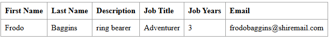

# Class Assignment 1: Technical Report

**Author:** Daniela Bento Martins (1241902)<br>
**Programme:** SWitCH DEV<br>
**Course:** DevOps</br>

### **Introduction**

This DevOps project is divided into two parts... 

Part 1 was also divided into three parts. The first, is intended to work without branches, the second relies on the use
of branches and the third, and final, explores an alternative solution to git.


### The Setup
Due to the nature of this project some configurations and changes needed to be made so that the application runs smoothly.
I will be explaining these changes in the following steps.

- **Cloning the tutorial**

We were given access to a repository containing the Tutorial React.js and Spring Data REST application. This allowed us
to clone it and create a local copy using the following command:

```shell
git clone https://github.com/spring-guides/tut-react-and-spring-data-rest
```

- **Creating my repository**

I then created my own repository *devops-24-25-1241902* in github to use throughout this project for all the assignments.
Once my repository was created, I cloned it into the right folder on my computer using the command:<br>
```shell
git clone <repository-URL> "C:\Users\danie\Desktop\SWitCH\2_Semestre\DevOps"
```

- **Copying the 'basic' folder**

In order to be able to run the application, I had to copy the basic folder inside the first repository to my own.
I created the folder *CA1* and inside, the folder *part1*. 

```shell
 cp -r "C:\Users\danie\Desktop\SWitCH\2_Semestre\DevOps\tut-react-and-spring-data-rest\basic" "C:\Users\danie\Desktop\SWitCH\2_Semestre\DevOps\devops-24-25-1241902\CA1\part1"
 ```


- **Creating the .gitignore file**

Next, a .gitignore file was needed to showcase the list of files and directories to ignore when making a commit. For this,
I used [this website](https://www.toptal.com/developers/gitignore/) to generate this file and then added it to my
repository.

- **Executing the application**

With everything set, I am now able to run the application through my repository whenever I need it. To do this, I need 
to move to the *basic* folder and run the command ``/mvnw spring-boot:run`` 
After this, I need to enter [this url](http://localhost:8080/) to check the application.

- **Structuring and organising the project**

Throughout this project I will be using **Issues** feature in GitHub as a way to keep track of my tasks and ideas. These
issues can also be linked to my commits if I refer to them in my commit message.
As seen by the following example, I created an issue regarding one of the main tasks for this project named *"Add 'Job
Years' - validation and testing #1"* and the message contained a direct reference to the number of that issue, thus linking them.
~~~shell
git commit -m "Added validations and tests to Employee (related to issue #1)"
~~~

**Tags** will also play a very important part in the making of this project. They are used to mark specific points in
the repository's history. These tags can, and will, be pushed to the remote repository to ensure everyone can understand
the structure of this project. Using the following commands allow us to send add a tag to our project and then push it to the
remote repository:

~~~shell
git tag v1.0.0
git push origin v1.0.0
~~~

- **Starting**
My first commit to the GitHub repository (*'Initial Commit'*) was meant to officially establish the version history of my assignments 
in a remote location and thus ensure an organised start. For this I used the command ``git push -u origin main``.

The second (and most meaningful commit) sent to the repository happened once all of these changes and configurations were
all set. This commit (*'Added Basic folder and did small tweaks'*) followed the structure where I staged,
committed, and pushed my changes to the remote repository:

~~~shell
git add .
git commit -m "Added Basic folder and did small tweaks"
git push
~~~

## Part 1
As referenced earlier, this assignment  will follow a structured approach to version control and feature development. The first part of the project will be developed entirely within the master branch,
In the second part, branching strategies will be introduced to manage development more effectively. Additionally, I will also explore and present an alternative technological solution for version control that does not rely on Git.

### Part 1.1

### Goals & Requirements
 - Use of *tags* to keep track of the versions of the application;
 - Develop a new feature to add a new field to the application (*Job Years*);
 - Add unit tests for testing the creation of Employees and the validation of their attributes;
 - Practice debugging both the server and the client.
 - Use meaningful commits and tags.

### Development 
As mentioned before, I began by copying the basic folder from the given repository and commit it with the right tag associated to it. For this project, I am meant to follow the major.minor.revision
pattern so this was tagged as **v1.1.0**. I was able to do this with the aforementioned commands.

Regarding the development of the new feature, we were tasked with adding a new field *Job Years* to the Employee entity. As the provided example mentions the fictional world of Lord 
of the Rings, I chose to maintain this theme by using similar examples in my tests.

I will go through each class, detailing the changes and additions made, including new methods, attributes, and tests, to fulfil the project requirements.

- **Employee.java:** 

- As requested, I added the jobYears field along with its getter and setter methods. To ensure data integrity, I also included validations in the setter methods. This was done to prevent invalid values, 
from being assigned and thus avoids potential errors. Both methods for jobYears can be found below and the setter method illustrates the updates
made to the other setter methods:

~~~java
	public int getJobYears(){
		return jobYears;
	}

	public void setJobYears(int jobYears) {
		if(areJobYearsInvalid(jobYears))
			throw new IllegalArgumentException("Insert a valid number of job years.");
		this.jobYears = jobYears;
	}
~~~

It was also necessary to validate all attributes: First Name, Last Name, Description, and Job Years. The first three, being of type String, were validated to ensure they were
neither null nor empty. For Job Years, an int type, I decided to restrict the value to non-negative numbers, with an upper limit of 100.

~~~java
	private boolean isFirstNameInvalid (String firstName) {
        return firstName == null || firstName.isBlank();
    }

	private boolean isLastNameInvalid (String lastName) {
		return lastName == null || lastName.isBlank();
	}

	private boolean isDescriptionInvalid (String description) {
		return description == null || description.isBlank();
	}
    
    private boolean isJobTitleInvalid (String jobTitle) {
        return jobTitle == null || jobTitle.isBlank();
    }

	private boolean areJobYearsInvalid(int jobYears) {
		
		return jobYears < 0 || jobYears > 100;
	}
~~~ 
Finally, I added validation to the Employee constructor by calling the existing validation methods for each attribute. This makes sure that any invalid data is caught when creating 
an Employee.

~~~java 
	public Employee(String firstName, String lastName, String description, int jobYears) {

		if(isFirstNameInvalid(firstName)){
			throw new IllegalArgumentException("First name cannot be empty!");
		}

		if(isLastNameInvalid(lastName)){
			throw new IllegalArgumentException("Last name cannot be empty!");
		}

		if(isDescriptionInvalid(description)){
			throw new IllegalArgumentException("Description cannot be empty!");
        }
        
        if(isJobTitleInvalid(jobTitle)){
            throw new IllegalArgumentException("Job title cannot be empty!");
        }

		if (areJobYearsInvalid(jobYears)){
			throw new IllegalArgumentException("Insert a valid number of job years.");
		}

		this.firstName = firstName;
		this.lastName = lastName;
		this.description = description;
        this.jobTitle = jobTitle;
        this.jobYears = jobYears;

	}
~~~

- **EmployeeTest.java**: 

This class was added to the newly created test directory, as there were no existing tests for the Employee class. 
The tests focus on verifying the functionality of the Employee constructor and ensuring that attribute validation works correctly

~~~java
@Test
    void shouldCreateEmployee() {
        //Arrange

        // Act
        Employee employee = new Employee("Frodo", "Baggins", "Ring Bearer","Adventurer", 3);

        // Assert
        assertNotNull(employee);
        assertEquals("Frodo", employee.getFirstName());
        assertEquals("Baggins",employee.getLastName());
        assertEquals("Ring Bearer", employee.getDescription());
        assertEquals("Adventurer",employee.getJobTitle());
        assertEquals(3,employee.getJobYears());
    }
    

    public static Stream<Arguments> provideInvalidArguments() {
        return Stream.of(
                arguments(null,"Baggins","Ring Bearer","Adventurer",3,"First name cannot be empty!"),
                arguments("","Baggins","Ring Bearer","Adventurer", 3,"First name cannot be empty!"),
                arguments(" ","Baggins","Ring Bearer","Adventurer", 3,"First name cannot be empty!"),
                arguments("Frodo",null,"Ring Bearer","Adventurer", 3,"Last name cannot be empty!"),
                arguments("Frodo","","Ring Bearer","Adventurer", 3,"Last name cannot be empty!"),
                arguments("Frodo"," ","Ring Bearer","Adventurer",3,"Last name cannot be empty!"),
                arguments("Frodo","Baggins",null,"Adventurer",3,"Description cannot be empty!"),
                arguments("Frodo","Baggins","","Adventurer",3,"Description cannot be empty!"),
                arguments("Frodo","Baggins"," ","Adventurer",3,"Description cannot be empty!"),
                arguments("Frodo", "Baggins", "Ring Bearer",null,3, "Job title cannot be empty!"),
                arguments("Frodo", "Baggins", "Ring Bearer","",3, "Job title cannot be empty!"),
                arguments("Frodo", "Baggins", "Ring Bearer"," ",3, "Job title cannot be empty!"),
                arguments("Frodo","Baggins","Ring Bearer","Adventurer",-1,"Insert a valid number of job years."),
                arguments("Frodo","Baggins","Ring Bearer","Adventurer",101,"Insert a valid number of job years.")
        ); 
    }
    @ParameterizedTest
    @MethodSource("provideInvalidArguments")
    void testInvalidArguments(String firstName,String lastName, String description, String jobTitle, int jobYears, String expectedMessage) throws IllegalArgumentException {

        // Act + Assert
        IllegalArgumentException exception = assertThrows(IllegalArgumentException.class, () -> {
            new Employee(firstName,lastName,description,jobTitle,jobYears);
        });
        assertEquals(expectedMessage, exception.getMessage());
    }
~~~ 

The following examples demonstrate tests for the setter methods of the Employee class attributes.For each attribute, I’ve included two tests:
one that uses valid values to ensure the setter updates the attribute correctly, and another that uses invalid values to verify that the appropriate exception is thrown.
For the String type attributes, tests are focused on handling null and empty values, while for the int type attribute, tests ensure that the job years fall within an acceptable range (e.g., between 0 and 100).

Below is an example of a test for setting a valid value for job years, followed by a test that verifies invalid job years trigger the appropriate exception.

~~~java
    @Test
    void testSetJobYears_ValidValue() {
        //arrange
        Employee employee = new Employee();
        //act
        employee.setJobYears(5);
        //assert
        assertEquals(5, employee.getJobYears());
    }
    @Test
    void testSetJobYears_InvalidValue() {
        Employee employee = new Employee();

        assertAll(
                () -> assertThrows(IllegalArgumentException.class, () -> employee.setJobYears(-1)),
                () -> assertThrows(IllegalArgumentException.class, () -> employee.setJobYears(101))
        );
    }
~~~ 

- **DatabaseLoader.java:**

The class was modified to incorporate the jobYears field when saving sample employee data to the database. This update ensures that the employee records now include the 
number of years each employee has worked, enabling the application to showcase this feature immediately upon startup.

~~~java
	@Override
	public void run(String... strings) throws Exception { // <4>
		this.repository.save(new Employee("Frodo", "Baggins", "ring bearer","Adventurer",3));
	}
~~~

- **app.js:**
- 
The React components were updated to include the new jobYears field, allowing users to view the number of years an employee has worked. The EmployeeList 
and Employee components now display this information in a dedicated 'Job Years' column within the employee table, ensuring that the feature is visible right from the start.

~~~javascript
class EmployeeList extends React.Component{
	render() {
		const employees = this.props.employees.map(employee =>
			<Employee key={employee._links.self.href} employee={employee}/>
		);
		return (
			<table>
				<tbody>
				<tr>
					<th>First Name</th>
					<th>Last Name</th>
					<th>Description</th>
					<th>Job Title</th>
                    <th>Job Years</th>
				</tr>
				{employees}
				</tbody>
			</table>
		)
	}
}
// end::employee-list[]

// tag::employee[]
class Employee extends React.Component{
	render() {
		return (
			<tr>
				<td>{this.props.employee.firstName}</td>
				<td>{this.props.employee.lastName}</td>
				<td>{this.props.employee.description}</td>
				<td>{this.props.employee.jobTitle}</td>
                <td>{this.props.employee.jobYears}</td>

			</tr>
		)
	}
}
~~~

**Debugging**

After making sure the jobYears field was integrated, I ran the app using ``./mvnw spring-boot:run `` to test it live at `` http://localhost:8080/``  This helped me 
check that everything was working as expected in the app and that the feature fit in smoothly with the rest of the functionality. I also did a quick code review to
ensure the data was being handled correctly on the server side and that jobYears was displaying properly on the client side.

**Finishing up**

Once everything was running smoothly, I needed to commit these changes to the remote repository. As previously mentioned, I add created an *Issue* with the title 'Add 'Job Years'- 
validation and testing #1' and so, I needed to reference it to link them together. For this, the steps followed were:
~~~shell
git add .
git commit -m "Added validations and tests to Employee (related to issue #1)"
git push
~~~
I also needed to add a new tag to indicate that this part was completed. As I learned that tags can be annotated, I started adding´notes related to the commit I was 
linking the tag with. For this I ran the following commands:

~~~shell
git tag v1.2.0 -m "Employee validations and tests"
git push origin v1.2.0
~~~
I also learned that using ``git show <NameOfTag>`` allows me to see all the details related to the specific tag.

To finalise, it was intended for me to send this README file as proper documentation for this part. So, I added a new commit and marked it with the tag *ca1-part1.1*.

~~~shell
git add .
git commit -m "Updated README file (related to issue #2)."
git tag ca1-part1.1 -m "Updated the ReadMe file for part 1.1"
git push
git push origin ca1-part1.1
~~~

### part 1.2

### Goals & Requirements

- Implement a Git workflow using feature and bug-fix branches to ensure isolated development;
- Develop and test a new feature (*email field) in a dedicated branch;
-Create a second branch (fix-invalid-email) to address and validate proper email formats.
- Practice debugging both the server and the client.
- Merge completed and tested branches into the master branch.
- Use meaningful commits and tags.

### Development 

This part focuses on implementing a branch-based development workflow. With this approach, I can ensure that
the master branch remains stable for publishing the application. Throughout this part I used two different branches
that helped me achieve this goal. 

The project requirements included adding a new feature with corresponding tests and addressing bug fixes. To
avoid redundancy, I have chosen not to show the full code again and instead, focus solely on the creation and
use of branches.

- #### Using the master branch 

To start out this section, I used the command ``git branch`` to confirm that I was on the right branch, in this case
*main*. At this point, this command proved to be necessary, but it became very useful throughout the project as 
new branches were added. This helped me confirm that I was working on the correct branch.

- #### Developing new features 
A new branch was created to isolate and manage all developments associated with the new email feature. To do this, I used a new command to create the *email-field* branch and in it, I was able to
add the email feature to the employee without working on the main branch. Here I'll showcase the commands I used, the first relates to the creation of a new branch. With this command, I
automatically move to this branch. However, I can always use the second command to check if I am on the right location.

~~~shell
git checkout -b email-field
git branch
~~~

- #### Integration and Testing of the Email Field
As stated before, adding the feature *email* mirrors the addition of *jobYears* in part 1.1.
To summarize, the email was added to the employee, I created a specific getter and a setter method and updated all the classes that contained information about the employee. In the 
**Employee.java** I also added a method to validate this new field. At this point of the project, the only validation necessary was whether the String sent was null or blank. Therefore,
at this point, the method looked as such:

~~~java
private boolean isEmailInvalid(String email) {
		return email == null || email.isBlank();
	}
~~~

It was necessary to update all existing tests to accommodate the new email field, and I also added two new tests specifically
for the email setter method. The first test checks for a valid email whilst the second checks for invalid values.

~~~java
@Test
    void testSetEmail_ValidValue() {
        //arrange
        Employee employee = new Employee();
        //act
        employee.setEmail("frodobaggins@shiremail.com");
        //assert
        assertEquals("frodobaggins@shiremail.com",employee.getEmail());
    }

    @Test
    void testSetEmail_InvalidValue() {
        Employee employee = new Employee();

        assertAll(
                () -> assertThrows(IllegalArgumentException.class, () -> employee.setEmail(null)),
                () -> assertThrows(IllegalArgumentException.class, () -> employee.setEmail("")),
                () -> assertThrows(IllegalArgumentException.class, () -> employee.setEmail(" "))
        );
    }
~~~~


Finally, I debugged both the server and client components of the application as to detect and resolve any issues introduced
by the creation of the email field.

- #### Merging with the main

To merge changes from the email-field branch, I first committed the updates. In the message I mention the previously
created issues with 'Closes #3 #4 #7'. I have learned that using a keyword like *closes* or *fixes* along with the number
of the issue inside the commit message, automatically closes it. However, in this case, only issue #3 closed. As I looked
into this, I understood that I need to write *closes* before each issue if I want all of them to close. In the future, I
will apply this command properly.

Going back to the merging, I then pushed the email-field branch upstream with ```git push --set-upstream origin email-field```.
After switching to the main branch, I merged the email-field branch with the *--no-ff* option to maintain a clear commit history. 
The updated main branch was then pushed using git push. Finally, I tagged the new version as v1.3.0 and pushed the tag to the remote repository.

~~~shell
#commit the changes
git add .
git commit -m "Added new email field and tests. Closes #3 #4 #7"

#push the email-field branch upstream
git push --set-upstream origin email-field

#switch to main and merge the changes
git checkout main
git merge  - -no-ff email-field

#push to update the main branch
git push

#tag
git tag v1.3.0
git push origin v1.3.0
~~~

- #### Creating a new branch for bug fixing

It was now necessary to create another branch to address the bug fix for email validation. This new branch was
created with the command ``git checkout -b fix-invalid-email`` similarly to the previous branch.

I created the fix-invalid-email branch to address bugs in email validation and ensure that any email sent contains 
an "@" sign. This fix involved enhancing the Employee class with validation logic to enforce the correct email format.
I went back to the method *'isEmailInvalid'* and added the new requirement:

~~~java
private boolean isEmailInvalid(String email) {
		return email == null || email.isBlank() || !email.matches("^[A-Za-z0-9+_.-]+@[A-Za-z0-9.-]+$");
	}
~~~

Though I could have used something like *email.contains("@")* to do this verification, I decided to go a little further and 
create a regex to ensure that the email abides normal email rules. This is a more detailed and strict approach that can
catch more errors. The alternative would allow emails to contain a '@' without a local or a domain part. It could also allow 
two or more '@' hence why I chose a stricter version. Below is the same test seen before but with more invalid emails
that don't fit the regex rules.

~~~java
  @Test
    void testSetEmail_InvalidValue() {
        Employee employee = new Employee();

        assertAll(
                () -> assertThrows(IllegalArgumentException.class, () -> employee.setEmail(null)),
                () -> assertThrows(IllegalArgumentException.class, () -> employee.setEmail("")),
                () -> assertThrows(IllegalArgumentException.class, () -> employee.setEmail(" ")),
                () -> assertThrows(IllegalArgumentException.class, () -> employee.setEmail("frodobaggins.shiremail.com")),
                () -> assertThrows(IllegalArgumentException.class, () -> employee.setEmail("frodobaggins@")),
                () -> assertThrows(IllegalArgumentException.class, () -> employee.setEmail("@shiremail.com")),
                () -> assertThrows(IllegalArgumentException.class, () -> employee.setEmail("frodo@@shiremail.com"))
        );
    }
~~~

- #### Wrapping up

I repeated the previous steps mentioned regarding testing and validating this new update. I merged everything with the main
branch using the steps aforementioned and added the tag **v1.3.1** (which indicates a minor fix) to this commit.
This version update shows the ongoing improvements in the application's functionality and reliability.

Once everything was finished, this part of the assignment was sent to the repository with the tag **ca1-part1.2**. 


### **The Results**

- **Implementation** 

At the end of these two parts of the Class Assignment 1, the application looked as follows:



While the first three fields (First Name, Last Name, and Description) were already part of the model, I added the
**Job Years** and **Email** sections in this project. The part *Job Title* was intended to be added during the introduction/demonstration
of this project. Due to a smaller issue, I was only able to add it once I was finishing part1.2 of this assignment. Therefore,
I went back and added the field to all the classes necessary and updated all the methods. I also updated this ReadMe file
and all the examples provided as to illustrated what was required. This version was tagged with ```v1.1.1``` as it should have been a 
follow-up on that section.

These additions provide a more complete and detailed view of what makes up an Employee.

- **Branches**
The branches created can still be found in the repository using the command ``git branch`` and the * symbol indicates
which branch the user is on at the moment.


- **Tags**
Using the command ``git tag`` I am able to see which tags I have used for this project. This allows me to organise
myself and this assignment whilst marking specific points of its history as significant. Below is an example of all the
tags I have used so far:


- **Issues** 

 *Issues* was the perfect tool to keep me organised and to keep track of what needed to be done. During the first part
of this assignment (part1.1) I closed all the issues manually. However, I then learned that I can close them automatically
using the commit messages. This approach is much simpler and easier to see the history of the problem and how it was
solved. The picture below exemplifies some of the issues I created for this project.


---
This section gives a clear view of how the application evolved, with new features added, branches used for development,
and milestones marked with tags. The visuals provided show how version control works and how the project grew over time. 
Using issues also helped keep everything organised and easy to follow, making sure all the changes are well-documented.