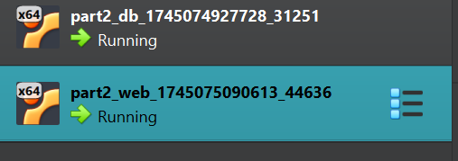

~~# Class Assignment 2: Virtualization with Vagrant

**Author:** Daniela Bento Martins (1241902)<br>
**Programme:** SWitCH DEV<br>
**Course:** DevOps</br>

### Table of Contents

- [Introduction](#introduction)
- [Part 1](#part-1)

- [Conclusion](#conclusion)

### Introduction


**Part 1** The goal is to practice with VirtualBox using the same projects from the previous assignments but now
inside a VirtualBox/UTM VM with Ubuntu

**Part 2**  The goal of Part 2 of this assignment is to use Vagrant to set up a virtual
environment to execute the tutorial spring boot application, gradle "basic" version
(developed in CA1, Part3)


---

##  Part 1

### Setting Up

This report focuses on virtualization with VMware Workstation in this course. The goal was to get hands-on 
experience setting up and managing virtual machines for software development and operations.

Since I had already set up my virtual machine in a previous course (SCOMRED), I didn’t need to go through 
the initial configuration steps again. My VM was already configured with a Host-only network, a static IP 
address, and essential network tools, allowing me to focus directly on the project tasks. Below is an example
of the aforementioned configuration needed.


However, I needed to remotely manage my Virtual Machine. For that, I installed the **OpenSSH** server by using
the command `sudo apt install openssh-server` and then configured it by enabling password authentication. For this,
it was necessary to edit `/etc/ssh/sshd_config` by uncommenting the line `PasswordAuthentication yes`. Once these steps were
completed, I used the command `sudo service ssh restart` to restart the service.

I then had to set up a FTP server so that I could transfer files to and from the VM. I used the command `sudo apt install vsftpd`
to install it and then configure it. I moved to the `/etc/vsftpd.conf` file and uncommented the line `write_enable = YES`.
Once again, I restarted the service with `sudo service vsftpd restart` so that I could begin working on the project.

Below is an example of what these configurations looked like.


### Cloning the Repository

The next step required that my repository got cloned inside my Virtual Machine. For this, I configured secure SSH access
to connect the VM with my GitHub repository.

First, I needed a SSH Key. I generated it in my VM's terminal so that I could securely connect to GitHub. Once it was created,
I displayed it in the terminal. I used the following commands for those steps:

~~~bash 
#generating the key
ssh-keygen -t ed25519 -C "1241902@isep.ipp.pt"

#displaying the key
cat ~/.ssh/id_ed25519.pub
~~~

Then, I logged into my GitHub account's settings so that I could save my key. I headed to **SSH and GPG keys**
and pasted my key in the provided field. This allowed my VM to securely authenticate with GitHub.

Finally, I was able to clone my repository using the following command on my VM's terminal:

`git clone git@github.com:danielabmartins/devops-24-25-1241902.git`

###  Preparing the Development Environment

For this assignment, I am expected to practice using the VM with my previous assignments.To do so, I’ll have to install 
all the dependencies I’ve used before inside VMware.  
Below are all the commands used to install the different dependencies require:

~~~bash
#update and upgrade the already installed packages
sudo apt update
sudo apt upgrade

#install Git for version control and source code management
sudo apt install git 

#install JDK and JRE for Java-based projects
sudo apt install openjdk-17-jdk openjdk-17-jre

#install Maven for building and managing Java projects
sudo apt install maven

#install Gradle for building and managing Java projects
wget https://services.gradle.org/distributions/gradle-8.6-bin.zip
sudo mkdir /opt/gradle
sudo unzip -d /opt/gradle gradle-8.6-bin.zip
~~~

To make Gradle accessible from anywhere in the terminal, I added its bin directory to the system
PATH by updating the *.bashrc* file:  
~~~bash
echo "export GRADLE_HOME=/opt/gradle/gradle-8.6" >> ~/.bashrc
echo "export PATH=\$GRADLE_HOME/bin:\$PATH" >> ~/.bashrc
source ~/.bashrc****
~~~

To ensure that everything was installed correctly and that I was able to start working on my projects,
I used the following commands:

~~~bash
git --version
java --version
mvn --version
gradle --version
~~~


### Executing the Spring Boot Tutorial Basic Project

My first requirement was to execute the Spring Boot Tutorial Basic Project that I worked with before.
This time, I needed to build and run the project inside my Virtual Machine.

I started by heading to the basic folder inside my repository as this was where the application was.
Before I started  running the commands, I installed the wrapper by using ``mvn -N wrapper:wrapper`` and once 
this was ready, I executed the command `./mvnw spring-boot:run`.  
Similarly to my first assignment,I needed to access the application. This time, however, I wanted to ensure
that it was accessible externally. For this, I used the URL `http://192.168.56.5:8080/` with my VM's
IP address that I found using the ``ifconfig`` command.  

Once accessed, I was able to see the application running correctly. This meant that the backend was working
and that the framework was serving the content perfectly.


### Executing the Gradle_Basic_Demo Project (1)

For this part, I am going to focus on building and running the gradle_basic_demo from CA1.2. Due to the
nature of this project, I needed to run the application in two environments: the virtual and the host machine.

I first moved to the gradle_basic_demo directory in my Virtual Machine where I executed the command ``gradle wrapper``
so that I could install the wrapper. Then, I was able to run the following command:

``./gradlew build``

Since I was using an Ubuntu Server, I did not have a desktop environment to run GUI apps like this 
project's chat client. In order to make this work, I opened a terminal on my host machine and 
moved to the gradle_basic_demo directory. Once I ran the appropriate command I created the Client
that could then communicate with the Server running on my Virtual Machine.
Below is the command I used with my VM's IP address and the port number:
``./gradlew runClient --args="192.168.56.5 59001" ``


As seen in the images above, I successfully ran the command and opened the chat windows which ensured
that the application was running smoothly. 


### Executing the Gradle_Basic_Demo Project (2)
I was now meant to work on developing and running another component of the
gradle_basic_demo project within the virtual machine. The expected outcome should
be the table with employee information provided in the Spring Boot Tutorial Basic Project.

To begin, I headed to the folder 'react-and-spring-boot' and ran the following commands
to build and run the application properly.
~~~bash
./gradlew build

./gradlew bootRun
~~~

I then headed to my browser with the URL http://192.168.56.5:8080/ so that I could
see the landing page of the Spring Boot application. As expected, I could see the table
with all the employee's information on it. This meant that everything
was running smoothly and I had completed the task with success.


---
# Part 2
##  Part 2.1

This report for Class Assignment 3 – Part 2 focuses on virtualisation through the use of Vagrant.
The objective for this part was to configure a virtual environment capable of deploying a Spring Boot application linked to an H2 database.

A pre-existing Vagrantfile served as the starting point and was modified to meet the assignment’s requirements.
This report details the configuration process, integration of the Spring Boot project, and successful deployment.

### Setting Up

To begin this section of the assignment, I needed to prepare my virtual environment.  
I headed over to the [Vagrant website](https://developer.hashicorp.com/vagrant/install) and downloaded the application into my computer.
Once the installation process was finished, I ran the command ``vagrant --version`` as to ensure that everything was set.


I also needed to update my **.gitignore** file with ```.vagrant/``` so that unecessary files would not be commited to the repository,

Now that the environment was properly set up, I started setting up the *Base Project* with the following steps:

- **Downloading the Base Project**  
I began by cloning the [Base Project](https://bitbucket.org/pssmatos/vagrant-multi-spring-tut-demo/src) to my computer. This project
included the **Vagrantfile** as well as all the initial configurations to set up the Virtual Machines.

- **Copying the Vagrantfile**  
I needed the aforementioned Vagrantfile inside my repository and for that I used the following command to copy it:
~~~bash
cp Vagrantfile "C:\Users\danie\Documents\devops-24-25-1241902\CA2\part2"
~~~

- **Starting the Virtualised Environment**  
Right after copying the file into the desired path, I ran the following command to start my VMs.

~~~bash
vagrant up
~~~

As seen in the image below, this command created two virtual machines. One for the database (**db**) and one for
the Spring Boot application (**web**).



- **Accessing the application** 
The next step was to access the Spring Boot application using the following URLs:
- 
~~~web 
http://localhost:8080/basic-0.0.1-SNAPSHOT/
http://localhost:8080/basic-0.0.1-SNAPSHOT/h2-console
~~~

### Configuring the Vagrantfile  

The **Vagrantfile** is a configuration file that tells Vagrant how to set up and manage virtual machines. It includes details
like which operating system to use, how much memory to allocate, and any software that needs to be installed.  
For this project,I had to make a few key changes to fit the requirements of the Spring Boot application and its connection to the H2 database.

- **Updating the Repository URL**   
I began by updating the Git repository URL so that it pointed to my own project, which contains a Spring Boot application built with Gradle.

~~~bash 
git clone git@github.com:danielabmartins/devops-24-25-1241902.git
~~~

- **Changing the path**  
After this, I also modified the path to point to the specific directory I needed

~~~bash 
cd devops-24-25-1241902/CA1/part3/react-and-spring-data-rest-basic
~~~

- **Adding the bootRun command**  
I also included the following command in the provisioning script so that the application could start automatically.

~~~bash 
./gradlew bootRun
~~~

- **Updating the Java version**  
I altered the Java version in the original file to OpenJDK 17.

~~~bash 
openjdk-17-jdk-headless
~~~

- **Enabling the SSH Agent Forwarding**  
I added the following statement to allow the VM to use SSH credentials from the host machine.

~~~bash 
config.ssh.forward_agent = true
~~~

- **Automatically trusting GitHub’s SSH key**  
Lastly, I added a command to the provisioning script that adds *github.com* to the VM’s known SSH hosts, 
so it doesn’t ask for confirmation the first time it connects.

~~~bash 
if [ ! -n "$(grep "^github.com " ~/.ssh/known_hosts)" ]; then
   ssh-keyscan github.com >> ~/.ssh/known_hosts 2>/dev/null
fi
~~~

Since my project is stored in a private Git repository, I used SSH agent forwarding during VM provisioning.
This allows the VM to access my SSH credentials from the host machine, ensuring a smooth, automated process
without needing to set up additional credentials inside the VM.

For this to work, I created an SSH key (as explained in CA2 - Part 1) and added it to GitHub. After that, I followed
the commands below: 

~~~bash 
#starting the agent
eval "$(ssh-agent -s)"

#adding the SSH key
ssh-add ~/.ssh/id_ed25519 
~~~

After all of these configurations my Vagrantfile was completed and personalised to fit all the requirements for this
project.
The full file can be found [here](C:\Users\danie\Documents\devops-24-25-1241902\CA2\part2\Vagrantfile). 


### Connecting Spring Boot to H2 Database 

To connect the Spring Boot application to the H2 database running inside the virtual machine , 
I updated the application’s configuration files with the following changes in the CA1-Part3 folder:

- **application.properties**  

~~~ 
server.servlet.context-path=/basic-0.0.1-SNAPSHOT
spring.data.rest.base-path=/api
spring.datasource.url=jdbc:h2:tcp://192.168.56.11:9092/./jpadb;DB_CLOSE_DELAY=-1;DB_CLOSE_ON_EXIT=FALSE
spring.datasource.driverClassName=org.h2.Driver
spring.datasource.username=sa
spring.datasource.password=
spring.jpa.hibernate.ddl-auto=create-drop
spring.sql.init.mode=never
spring.h2.console.enabled=true
spring.h2.console.path=/h2-console
spring.h2.console.settings.web-allow-others=true
~~~

- **src/App.js**

~~~
client({method: 'GET', path: '/basic-0.0.1-SNAPSHOT/api/employees'}).done(response => {
~~~

### Running the application

To get everything up and running, I first navigated to the project directory in my terminal and ran the command
```vagrant up```. This command launches and provisions the two virtual machines (one for the application and 
one for the database) using the configuration defined in the Vagrantfile. The first run can take a bit of
time as the necessary packages and settings are applied during provisioning.

Once both VMs were running, I tested the Spring Boot application by going to:

~~~
http://localhost:8080/basic-0.0.1-SNAPSHOT/
~~~

I also checked the database by opening the H2 web console at:

~~~
~~~
This allowed me to verify that the Spring Boot application was correctly connected to the external H2 
database running inside the VM.

After connecting to the H2 database, I was able to explore the existing tables and check the stored data.
This confirmed that the application was properly linked to the H2 database. It was successfully performing
operations like reading and writing data, and the H2 console made it easy to inspect the contents of the
database directly from the browser.


---

##  Part 2.2

For the second part of this section, I looked into an alternative setup using VMware instead of VirtualBox.
VMware is a capable hypervisor that can be integrated with Vagrant to recreate the same virtualised environment,
offering a different approach to managing the project’s infrastructure.

Below are some of the key differences between **VMware** and **VirtualBox**:


| Feature                          | **VMware**                                           | **VirtualBox**                                       |
|----------------------------------|------------------------------------------------------|------------------------------------------------------|
| **Cross-platform Support**       | VMware Workstation for Windows/Linux; Fusion for macOS. | Available on Windows, macOS, and Linux.              |
| **Ease of Use**                  | Professional, polished UI, but more complex for beginners. | User-friendly and straightforward interface.         |
| **Hardware Compatibility**       | Often better support for newer hardware and features. | Broader compatibility across platforms, but may lag slightly in newer features. |
| **Licensing**                    | Commercial (paid) for VMware Workstation Pro / Fusion; VMware Vagrant plugin also requires a licence. | Free and open-source (Oracle VM VirtualBox).         |
| **Performance**                  | Generally faster and more efficient, especially with graphics and I/O-heavy workloads. | Slightly slower performance, but adequate for most development tasks. |
| **Snapshot Functionality**       | More advanced and stable snapshot system.            | Functional but less refined compared to VMware.      |
| **Vagrant Plugin Support**       | Requires a paid Vagrant VMware plugin.               | Has free and native support in Vagrant.              |

While both VMware and VirtualBox can be used with Vagrant to set up virtual environments, VirtualBox
is often preferred for its ease of use and free availability. VMware, on the other hand, may be a better
fit for performance-intensive projects or users who already have access to its paid features.

- **Using VMware**

If I were to use VMware for this project instead of VirtualBox the process would be almost the same, but it would
involve a few additional steps and configuration adjustments.

- First, I would need to install the **Vagrant VMware Utility**, which acts as a bridge between Vagrant and the 
VMware hypervisor. Without this utility, Vagrant wouldn't be able to interact with VMware to create or manage
virtual machines. 

- Next, I would have to install the **Vagrant VMware plugin**, which enables Vagrant to handle VMware-based
virtual machines in the same way it handles VirtualBox VMs. Since VMware is a commercial product, 
this extra step is necessary, unlike VirtualBox, which is natively supported by Vagrant. 

- Finally, the Vagrantfile must be updated to specify VMware as the provider. This involves replacing any 
reference to VirtualBox with vmware_desktop and configuring additional VM settings 
(such as memory allocation, CPU count) using VMware's specific syntax.

Below is an example of the required configuration:

~~~bash
Vagrant.configure("2") do |config|
  config.vm.box = "hashicorp/bionic64"
  config.vm.provider "vmware_desktop" do |v|
    v.vmx["memsize"] = "1024"
    v.vmx["numvcpus"] = "2"
  end
end
~~~
Alternatively, you can run the VMs by explicitly choosing the provider with the command:

~~~bash
vagrant up --provider=vmware_desktop
~~~

These steps would allow you to run the same project setup using VMware instead of VirtualBox. Running *vagrant up* would create
and configure the VMs, just like with VirtualBox. No changes would be needed in the application code or provisioning.
As long as the correct Vagrant box and provider are set, the setup works the same across both platforms.

--- 
### Concluding

This report covers setting up a virtualised development environment for CA2-Part 2, where I deployed a Spring Boot app connected to an
H2 database. I worked with a modified Vagrantfile, set up SSH access, and adapted the project to run across multiple VMs.

Through the process, I gained a better understanding of virtualisation and the challenges that come with it, like getting the 
host and VM to communicate. I also explained how VMware could be used as an alternative to VirtualBox. I learned that it is a bit more
complex to set up, but it offers better performance and more features, especially for larger systems.

The key takeaway from this section was how flexible Vagrant is, letting me switch providers without changing the core setup. This 
assignment boosted my confidence in working with virtual environments and DevOps tools, while also teaching me how things run in real
production setups.

---
# Part 3

The main aim of this assignment is to get familiar with Docker by creating Docker images and running containers for a chat app. 
This app was originally built and used in a previous assignment of this project. This time, with the help of Docker, we can make sure the
chat server works the same no matter where it runs.

There are two parts to this assignment:
- Building the chat server inside the Dockerfile.
- Building it on the host machine first, then copying the JAR file into the Docker image.

##  Part 3.1

To get started with this version (and the next one), I first downloaded Docker and set up an account. After that, I used the link shared
by my teachers to clone the repository into my desired folder(*Version1*) which gave me the Basic Gradle project to work with.

Since this first version needs the chat server to be  built directly inside the Dockerfile. This file outlines the steps required to build
a Docker image for the chat server.It starts off with a Gradle image that includes JDK 11, which is used to build the project inside the 
container. After that, it switches to a lighter JRE image to keep the final container small and efficient. The built JAR file gets copied
over from the build stage, and the server is set up to listen on port 12345 when the container runs.

The Dockerfile below includes comments explaining each step:

~~~dockerfile
# Use the Gradle image with JDK 11 to build the app
FROM gradle:7.0-jdk11 AS build

# Set the working directory inside the container
WORKDIR /app

# Copy the project folder into the container
COPY gradle_basic_demo ./

# Set up the Gradle wrapper
RUN gradle wrapper

# Make the Gradle wrapper script executable
RUN chmod +x gradlew

# Build the project using the Gradle wrapper
RUN ./gradlew build


# Use a lighter JDK runtime for running the built app
FROM eclipse-temurin:11-jre

# Set the working directory again for the runtime image
WORKDIR /app

# Copy the built JAR file from the build container to the runtime container
COPY --from=build /app/build/libs/*.jar app.jar

# Expose port 12345 so the app can receive connections
EXPOSE 12345

# Set the command to run the chat server when the container starts
ENTRYPOINT ["java", "-cp", "app.jar", "basic_demo.ChatServerApp", "12345"]
~~~

Once the Dockerfile was ready, I ran the following command to build the Docker image:
``docker build -t 1241902/chat-server:v1 .``

By using the **-t** flag, I am able to create a custom name and version so that I can identify it easier.

Next, I ran the command ``docker images`` to ensure that the image was built correctly. The image below shows the output of that command
as well as additional information for the image.


The next step was to run the Docker container and for that I used the command ``docker run -p 12345:12345 1241902/chat-server:v1``

The **-p** flag in the command is used to map ports between my host machine and the Docker container. In this case, I chose port *12345*
(which meant changing the port in the *build.gradle* file). The image below shows the command running.


Over on DockerDesktop, it was possible to see that the container was created as soon as the command was executed:


Now that the chat server was running, I needed to launch the chat client to verify that the application was functioning correctly.

To do this, I opened two new terminals and ran the following commands to start the Client side of the application:
~~~bash
./gradlew build
./gradlew runClient
~~~
The image below shows the interaction between the two clients whilst the server is running in the Docker container.


Once everything was running smoothly, it was time to push the Docker image to DockerHub. For this, I ran the following commands:
~~~bash
#tagging the image
docker tag 1241902/chat-server:v1 1241902/chat-server:v1
#pushing the image to DockerHub
docker push 1241902/chat-server:v1
~~~


After this, I checked the repository in DockerHub and got the confirmation that the image was indeed pushed.


